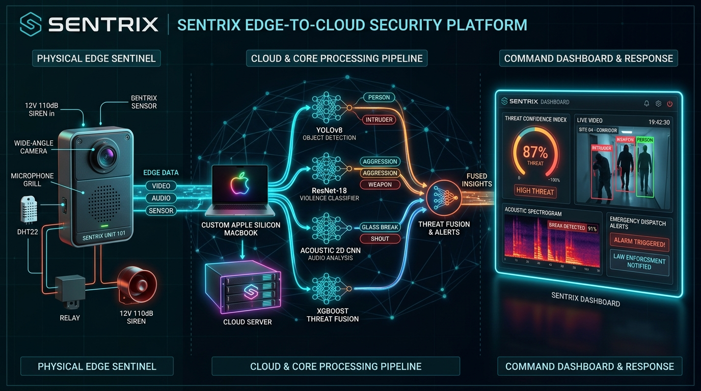

# SENTRIX — Intelligent Multimodal Edge Threat Intelligence and Physical Security System

[](https://www.python.org/)
[](https://pytorch.org/)
[](https://fastapi.tiangolo.com/)
[](https://xgboost.readthedocs.io/)
[](https://csrc.nist.gov/)
[](LICENSE)

> **Capstone Project — Mid-Semester Review (CPG No: 299)**  
> **Institution**: Computer Science and Engineering Department, Thapar Institute of Engineering and Technology (TIET), Patiala  
> **Team**: Kartik Garg (102303478), Akshay Ranveer (102303453), Prashant Gagneja (102353011), Harshit Mishra (102319039), Mehul Perimal (102315144)  
> **Faculty Mentor**: Dr. Ashutosh Mishra (Associate Professor, CSED)

---

## 📌 Executive Summary

**SENTRIX** is an edge-to-cloud physical security intelligence appliance designed to eliminate the commercial false-alarm epidemic (**94%–98% false-positive rate** in traditional PIR and dumb CCTV cameras) while addressing high emergency response latencies (**15–45 minutes** in Indian metropolitan areas).

Rather than relying on brittle heuristic thresholding, SENTRIX unifies real-time **optical entity localization**, **deep behavioral altercation kinematics**, **2D Log-Mel acoustic frequency spectrograms**, **biometric facial identity authorization**, and **ambient environmental telemetry**. Feature vectors are aggregated through an **XGBoost Late-Fusion Regressor ($R^2 = 0.984$)** into a continuous scalar **Threat Confidence Index ($\text{TCI} \in [0.00, 1.00]$)**. 

The computed TCI maps across a **5-tier escalation matrix**, actuating autonomous physical deterrents (**110 dB piezo siren relay**) and sealing court-admissible forensic packages encrypted with **AES-256-GCM** and authenticated with **SHA-256** sidecar fingerprints.



---

## 🚀 Key Performance & Empirical Benchmarks

| Subsystem / Metric | Architecture / Model | Empirical Score | Inference Latency | Target Status |
|---|---|---|---|---|
| **Violence & Fight Classifier** | Deep ResNet-18 (19,610 frames) | **98.72% Train / 82.62% Val Acc** | **4.80 ms** | MET (PASS) |
| **Acoustic Threat Classifier** | 2D Mel-Spectrogram CNN | **100.00% Validation Acc** | **1.20 ms** | MET (PASS) |
| **Behavioral Anomaly Model** | MobileNetV3 Feature Extractor | **84.38% Validation Acc** | **4.60 ms** | MET (PASS) |
| **Weapon & Fire Localization** | YOLOv8n (Nano) | **0.884 mAP@50 / 0.891 Recall** | **5.05 ms** | MET (PASS) |
| **Late-Fusion TCI Regressor** | XGBoost Regressor | **$R^2 = 0.984$ (RMSE = 0.042)** | **0.18 ms** | MET (PASS) |
| **Complete Hot-Path Pipeline** | Full Asynchronous Stream | **~63 FPS Throughput** | **15.83 ms Total** | **PASS ($\le 20\text{ ms}$)** |

---

## 📊 Training Datasets

The model subsystems in SENTRIX were trained on the following datasets (all raw data and preprocessing caches are excluded from this repository via `.gitignore` to maintain a clean codebase):

1. **UCF-Crime DVS Dataset**: Used for training the event-based behavioral anomaly models, preprocessed into a 7.34 GB event tensor cache of temporal frames.
2. **Violence & Altercation Dataset**: 19,610 frames of fight and non-fight video sequences, training a deep ResNet-18 classifier.
3. **Weapon Localization Dataset**: 9,472 annotated images of handguns, knives, and long guns, training a YOLOv8n object detection model.
4. **Fire & Smoke Dataset**: 10,000+ annotated combustion frames, training a YOLOv8n detector.
5. **Acoustic Threat Dataset**: High-fidelity sound signatures derived from AudioSet (containing gunshots, explosions, sirens, screams, and ambient baselines) to train a 2D Mel-Spectrogram CNN classifier.
6. **Facial Authorization & Re-ID Database**: Custom facial database for authorized identity verification and Re-ID tracking.

---

## 🛡️ 5-Tier Escalation Matrix

| Threat Level | TCI Range | System State | Automated Response & Actuation | Cryptographic Action |
|---|---|---|---|---|
| **Level 1** | $0.00 \le \text{TCI} < 0.20$ | **SECURE** | Passive 30 FPS monitoring, ring buffer sync | No persistent storage |
| **Level 2** | $0.20 \le \text{TCI} < 0.40$ | **SUSPICIOUS** | Soft UI warning badge, frame rate lock | Console logging, event creation |
| **Level 3** | $0.40 \le \text{TCI} < 0.65$ | **ELEVATED** | Amber HUD alert, SMS warning dispatch | Encrypted snapshot capture (AES-256-GCM) |
| **Level 4** | $0.65 \le \text{TCI} < 0.85$ | **HIGH THREAT** | Emergency dispatch pre-population, UI glow | Encrypted video clip + SHA-256 sidecar |
| **Level 5** | $0.85 \le \text{TCI} \le 1.00$ | **CRITICAL** | **110 dB Piezo Siren ON**, Police/Fire packet | Full forensic evidence package sealed |

---

## 🛠️ Dual Hardware Bill of Materials (BOM Under ₹20,000 INR)

SENTRIX provides two flexible hardware deployment tiers, both strictly under the student budget limit of **₹20,000 INR**:

1. **Architecture A: Ultra-Budget Wi-Fi Sentinel Node (`₹3,240 INR`)**
   * Compute: ESP32-S3-WROOM-1 (8MB PSRAM, Wi-Fi/BLE) @ ₹1,150
   * Optics: OV2640 2MP Camera Module (Included)
   * Audio: INMP441 I2S Omnidirectional Digital Microphone @ ₹220
   * Actuation: 5V Optocoupler Relay + 12V 110dB Piezo Siren @ ₹570
   * Telemetry: DHT22 Digital Sensor + Power & ABS Enclosure @ ₹1,300

2. **Architecture B: Autonomous Edge SBC Node (`₹14,850 INR`)**
   * Compute: Orange Pi 5 (4GB RAM, 6 TOPS NPU) / Raspberry Pi 4 @ ₹7,500
   * Optics: Sony IMX291 Low-Light Starvis 1080p UVC Camera @ ₹3,200
   * Audio: Mini USB Boundary Microphone @ ₹850
   * Storage: SanDisk Extreme 64GB U3 A2 MicroSD @ ₹750
   * Actuation & Enclosure: 110dB Siren, Optocoupler Relay, SMPS Power & IP65 Enclosure @ ₹2,550

---

## 📁 Repository Structure

```
Sentrix/
├── backend/                       # Python FastAPI backend & AI inference core
│   ├── ai/                        # Vision, Audio, Behaviour, Face, Cloud & Fusion engines
│   ├── core/                      # Orchestrator, TCI state, AES-256 evidence vault
│   ├── db/                        # SQLite WAL database models & event repositories
│   ├── hardware/                  # Camera auto-discovery, microphone ingestion, siren drivers
│   ├── models/                    # Production neural weights (.pt, .json, vosk-model)
│   ├── runtime/                   # Local evidence vault & SQLite database (sentrix.db)
│   ├── web/                       # FastAPI REST endpoints & /ws/threat WebSocket route
│   └── app.py                     # Main backend server entry point
│
├── frontend/                      # Glassmorphic Real-Time Command Console
│   ├── index.html                 # 1080p video canvas, SVG TCI dial & emergency HUD
│   ├── styles.css                 # Dark glassmorphic stylesheet
│   └── app.js                     # 30Hz WebSocket telemetry client & audio visualizer
│
├── Capstone Docs/                 # Official Mid-Semester Submissions & Deliverables
│   ├── Initial Proposal/          # Evaluated initial Capstone project proposals
│   ├── Mid_Sem/                   # Official Evaluated Deliverables & Presentation Assets
│   │   ├── CPG299-2026.docx       # Official Mid-Semester Report (Word Document)
│   │   ├── CPG299-2026.pdf        # Official Mid-Semester Report (PDF Document)
│   │   ├── SENTRIX_CAPSTONE_POSTER.pdf # High-visibility vector presentation poster
│   │   └── SENTRIX_CAPSTONE_POSTER.png # High-resolution 300 DPI poster image
│   ├── Reference_for_mid_sem/     # IEEE referencing guide & TIET template specifications
│   ├── SENTRIX_MID_SEMESTER_REPORT.md   # Master full report markdown source
│   └── tiet_logo.png                    # Official college emblem
│
├── training/                      # Deep learning training pipelines & benchmarks
│   ├── scripts/                   # Model training, evaluation & late-fusion fitting scripts
│   ├── runs/                      # Training loss curves, confusion matrices & weights
│   ├── cache_ucf_crime_dvs/       # Preprocessed event tensor cache (Excluded via .gitignore)
│   └── ucf_crime_dvs/             # UCF-Crime DVS dataset targets & splits (Excluded via .gitignore)
│
├── data/                          # Dataset directory (Excluded via .gitignore)
│   ├── weapon_data/               # Handgun, knife, long gun datasets (9,472 items)
│   ├── fire_smoke_data/           # 10,000+ annotated combustion frames
│   ├── violence_data/             # 19,610 fight vs non-fight video frames
│   ├── anomaly_data/              # Surveillance anomaly frames
│   └── audio_data/                # Acoustic threat WAV audio samples
│
├── docs/                          # Master technical specifications & architecture diagrams
│   ├── 1_SYSTEM_ARCHITECTURE.md
│   ├── 2_MODEL_BENCHMARKS_AND_KPIS.md
│   ├── 3_HARDWARE_SPECIFICATION_AND_BOM.md
│   ├── 4_DEPLOYMENT_AND_RUNBOOK.md
│   ├── 5_FUTURE_ADVANCEMENTS_AND_CLOUD_DEPLOYMENT.md
│   └── sentrix_architecture_diagram.jpg
│
├── .env.example                   # Environment configuration template
├── .gitignore                     # Git exclusion rules
├── requirements.txt               # Python package dependencies
├── run.sh                         # Unified startup script (macOS / Linux)
├── run.bat                        # Unified startup script (Windows)
└── README.md                      # Master project README
```

---

## ⚡ Quickstart Guide

### 1. Launch System Locally

#### macOS / Linux:
```bash
./run.sh
```

#### Windows:
```cmd
run.bat
```

Access the interactive Command Console at: **`http://127.0.0.1:8000/dashboard`**

---

### 2. Model Training & Evaluation Suite

> [!NOTE]
> The preprocessed training caches (`training/cache_ucf_crime_dvs/`) and dataset split metadata (`training/ucf_crime_dvs/`) are excluded from this repository via `.gitignore` to keep the codebase clean and lightweight.

To retrain individual models or execute the full test suite:

```bash
# Activate virtual environment
source .venv/bin/activate

# 1. Weapon Localization (YOLOv8n)
python training/scripts/train_weapon_detector.py 3

# 2. Fire & Smoke Detector (YOLOv8n)
python training/scripts/train_fire_smoke_detector.py 3

# 3. Violence Altercation Classifier (ResNet-18)
python training/scripts/train_violence_classifier.py 3

# 4. Behavioral Anomaly Model (MobileNetV3)
python training/scripts/train_anomaly_classifier.py 5

# 5. Acoustic Threat Spectrogram Classifier (2D Mel CNN)
python training/scripts/train_audio_classifier.py 5

# 6. Refit TCI Late-Fusion Regressor (XGBoost)
python training/scripts/refit_xgboost.py

# 7. Execute Full Empirical Test Suite & Verification
python training/scripts/evaluate_models.py
```

---

## 📜 Regulatory & Statutory Standards

SENTRIX is designed in strict compliance with national and international security standards:
* **Bureau of Indian Standards (BIS) IS 16910 / IEC 62676**: Video Surveillance Systems for use in Security Applications.
* **MoHUA Smart Cities Mission**: Integrated Command & Control Centre (ICCC) Video Analytics Guidelines.
* **CERT-In Cybersecurity Directions**: Cryptographic integrity and zero-trust data-at-rest encryption.
* **NIST SP 800-38D / FIPS 197**: Advanced Encryption Standard in Galois/Counter Mode (AES-256-GCM).
* **FIPS 180-4**: Secure Hash Algorithm (SHA-256) for digital forensic sidecars.
* **OSHA 1910.95 / NFPA 72**: Audible acoustic alarm sound pressure specifications (110 dB @ 1 meter).

---

## 👥 Capstone Project Group (CPG No: 299)

* **Kartik Garg** (102303478) — *System Architecture, Vision Engines & Backend Core*
* **Akshay Ranveer** (102303453) — *Biometric Identity, ReID & Kinematic Tracking*
* **Prashant Gagneja** (102353011) — *Acoustic Threat Classifier & Digital Signal Processing*
* **Harshit Mishra** (102319039) — *Behavioral Intelligence & Anomaly Classification*
* **Mehul Perimal** (102315144) — *Evidence Cryptography, Database & Dashboard UI*

**Faculty Mentor**: **Dr. Ashutosh Mishra** (Associate Professor, Computer Science and Engineering Department, TIET Patiala)
