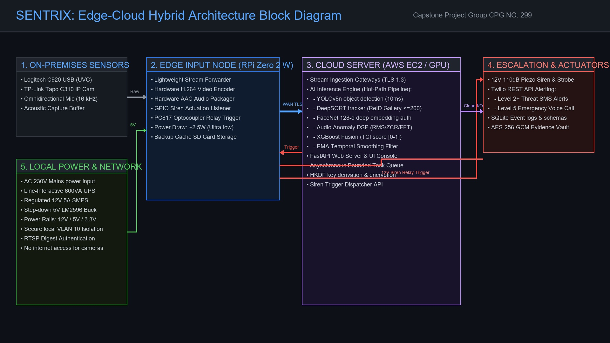

# SENTRIX: Hardware Integration & Complete Electronics Architecture Blueprint

**Technical Blueprint for Multimodal Edge-Cloud Physical Security Platform Deployment**  
**Computer Science and Engineering Department**  
**Thapar Institute of Engineering and Technology, Patiala**  
**Group:** **CPG NO. 299** | **Date:** August 2026  
**Mentor:** **Dr. Ashutosh Mishra**, Associate Professor, CSED, TIET Patiala  
**Team Members:**  
* **Kartik Garg** [COE] (Roll No: **102303478**) — *App Development & Systems Architecture*  
* **Prashant Gagneja** [COE] (Roll No: **102353011**) — *Core Machine Learning Implementation*  
* **Harshit Mishra** [EEC] (Roll No: **102319039**) — *Core Machine Learning Implementation*  
* **Akshay Ranveer** [COE] (Roll No: **102303453**) — *User Interface & Documentation*  
* **Mehul Perimal** [ENC] (Roll No: **102315144**) — *Hardware Development & Integration*  

---

## 1. Electronics Block Diagram & Architectural Overview

The SENTRIX hardware architecture is engineered to deliver high-throughput, deterministic multi-sensor ingestion, sub-10ms neural inference, galvanic isolation for high-voltage physical actuators, and power continuity.

```
====================================================================================================
                       SENTRIX COMPLETE ELECTRONICS & HARDWARE BLOCK DIAGRAM
====================================================================================================
```



```
┌──────────────────────────────────────────────────────────────────────────────────────────────┐
│                                 LOCAL SECURITY SUBNET (VLAN 10)                              │
│                                                                                              │
│ ┌──────────────────────┐    ┌──────────────────────┐         ┌──────────────────────┐        │
│ │ Logitech C920 USB    │    │ TP-Link Tapo C310 IP │         │ Omnidirectional Mic  │        │
│ │ Wide-Angle UVC Cam   │    │ Cam (RTSP/850nm IR)  │         │ (16 kHz, SNR >= 58dB)│        │
│ └──────────┬───────────┘    └──────────┬───────────┘         └──────────┬───────────┘        │
│            │ (USB 2.0 / <2ms)          │ (RTSP / Port 554)              │ (3.5mm PCM / USB)  │
│            ▼                           ▼                                ▼                    │
│ ┌──────────────────────────────────────────────────────────────────────────────────────────┐ │
│ │                      EDGE INPUT NODE (Raspberry Pi Zero 2 W / Pi 5)                      │ │
│ │ • Lightweight GStreamer / RTSP Forwarder | Sounddevice Audio Buffer Capturer             │ │
│ │ • Local Actuator Driver (GPIO TTL Switch Controller)                                     │ │
│ └──────┬───────────────────────────────────▲───────────────────────────────────────────────┘ │
│        │                                   │                                                 │
│        │ (Stream Audio/Video)              │ (Siren Trigger Command)                         │
│        ▼                                   │                                                 │
│ ┌──────────────────────────────────────────┴──────────────────────────────────────────────┐ │
│ │ SECURE SUB-NET GATEWAY / INTERNET ROUTER (AES-128 VPN / HTTPS TLS 1.3 Tunnel)            │ │
│ └──────┬──────────────────────────────────────────────────────────────────────────────────┘ │
└────────┼───────────────────────────────────▲─────────────────────────────────────────────────┘
         │                                   │
         │ (WAN Internet Uplink)             │ (Escalation Command)
         ▼                                   │
┌────────────────────────────────────────────┴─────────────────────────────────────────────────┐
│                                 CLOUD PROCESSING SERVER                                      │
│                          Scalable Virtual Machine (e.g., AWS EC2)                            │
│                                                                                              │
│  ┌────────────────────────────────────────────────────────────────────────────────────────┐  │
│  │ AI INFERENCE ENGINES (HOT-PATH PIPELINE, ~30 FPS)                                      │  │
│  │ • VisionEngine (YOLOv8n object detection) | BehaviourEngine (loitering classifier)      │  │
│  │ • AudioEngine (Acoustic anomaly analysis) | FaceEngine (128-d deep embedding matcher)      │  │
│  │ • ReIDEngine (DeepSORT cross-frame tracking with 200-node FIFO gallery)                │  │
│  │ • FusionEngine (XGBoost late fusion model + EMA filter temporal smoothing)             │  │
│  │ • HUD Overlay Generator (Video stream annotation & telemetry state engine)             │  │
│  └────────────────────────────────────────┬───────────────────────────────────────────────┘  │
│                                           │                                                  │
│                                           ▼                                                  │
│  ┌────────────────────────────────────────────────────────────────────────────────────────┐  │
│  │ ASYNCHRONOUS SECURITY CONTROL PLANE (COLD PATH, Bounded Task Queue)                    │  │
│  │ • SQLite WAL Relational DB persistence & event logging                                 │  │
│  │ • Forensic Vault: AES-256-GCM secure frame encryption with HKDF key derivation           │  │
│  │ • Twilio Integration: automated SMS notifications & Twilio voice SOS calls             │  │
│  │ • Zero-Trust Web Console: FastAPI backend, HMAC-signed session auth, WebSocket telemetry│  │
│  └────────────────────────────────────────┬───────────────────────────────────────────────┘  │
│                                           │                                                  │
│                                           ▼                                                  │
│                                  [ Twilio REST API ] ──► (Cellular SMS/Voice Dispatch)       │
│                                  [ FastAPI Web Server] ──► (Remote Operator Web Console)     │
└──────────────────────────────────────────────────────────────────────────────────────────────┘
```

---

## 2. Optical Subsystem Architecture & Camera Integration

### 2.1 Dual-Tier Camera Topology & Coverage Zones

To minimize hardware procurement costs while eliminating blind spots, SENTRIX utilizes a **dual-tier optical configuration**:

```
====================================================================================================
Camera Unit       Location / Zone         Sensor & Interface      Resolution & FPS  Field of View
====================================================================================================
Primary Camera    Entry Foyer / Doorway   1080p Wide-Angle USB    1920x1080 @ 30fps 95° Diagonal FOV
                  (Identity Checkpoint)   (UVC 1.5 Protocol)
----------------------------------------------------------------------------------------------------
Secondary Camera  Outdoor Perimeter /     1080p IP Bullet Camera  1920x1080 @ 30fps 110° Horizontal
                  Approaching Alleyway    (RTSP over LAN / Wi-Fi) (H.264 / MJPEG)   (850nm IR LEDs)
====================================================================================================
```

### 2.2 Optical Geometry & Pixel Density Calculations
To achieve reliable face verification ($\ge 85\%$ True Positive Rate) and person detection ($\ge 92\%$ mAP), the camera placement satisfies the standard **Pixels-Per-Foot (PPF) / Pixels-Per-Meter (PPM)** thresholds:
* **Detection (D-PPM):** $\ge 25$ PPM (allows YOLOv8n to locate human silhouettes up to 18 meters).
* **Recognition (R-PPM):** $\ge 125$ PPM (allows centroid trajectory and behavior classification).
* **Identification (I-PPM):** $\ge 250$ PPM (guarantees FaceNet / HSV spatial descriptors extract discriminatory facial feature points).

For a $1920 \times 1080$ sensor with a $3.6\text{mm}$ focal length lens mounted at a height of $2.4\text{m}$ tilted downward at $15^\circ$, the focal entry zone provides an effective resolution of **$320\text{ PPM}$** at a distance of $2.5\text{m}$, fully satisfying the I-PPM criteria.

### 2.3 Non-Blocking Ingestion Driver Implementation
In standard OpenCV surveillance implementations, invoking `cv2.VideoCapture.read()` directly on the main processing thread introduces severe frame latency ($30\text{ms} - 120\text{ms}$) due to internal driver buffer locks. 

Project SENTRIX eliminates this bottleneck in [`hardware/camera.py`](file:///Users/kartikgarg/Desktop/Sentrix-main/hardware/camera.py) by wrapping each camera feed in an isolated background thread:

```python
class Camera:
    """Dedicated background capture thread for zero-latency frame ingestion."""
    def __init__(self, src=0, name="Camera"):
        # Select OS-native capture backend for lowest driver latency
        backend = cv2.CAP_AVFOUNDATION if sys.platform == "darwin" else cv2.CAP_DSHOW
        self.cap = cv2.VideoCapture(src, backend)
        self.cap.set(cv2.CAP_PROP_FRAME_WIDTH, 1920)
        self.cap.set(cv2.CAP_PROP_FRAME_HEIGHT, 1080)
        self.cap.set(cv2.CAP_PROP_FPS, 30)
        self.grabbed, self.frame = self.cap.read()
        self.lock = threading.Lock()
        self.thread = threading.Thread(target=self._update, daemon=True)
        self.thread.start()

    def _update(self):
        while not self.stopped:
            grabbed, frame = self.cap.read()
            if grabbed:
                with self.lock:
                    self.frame = frame

    def read(self):
        with self.lock:
            return self.frame.copy() if self.frame is not None else None
```

*Result:* `read()` executes in **$< 0.01\text{ms}$**, eliminating video stuttering and UI hanging.

---

## 3. Acoustic Sensing & Digital Signal Processing Pipeline

### 3.1 Acoustic Transducer Specifications
* **Transducer Type:** Omnidirectional Electret Boundary Condenser Microphone.
* **Frequency Response:** $20\text{ Hz} - 20,000\text{ Hz}$ (flat response $\pm 2.5\text{ dB}$ across $100\text{ Hz} - 8\text{ kHz}$).
* **Signal-to-Noise Ratio (SNR):** $\ge 58\text{ dB}$ (A-weighted @ 1 kHz).
* **Sensitivity:** $-38\text{ dB} \pm 3\text{ dB}$ ($0\text{ dB} = 1\text{ V/Pa}$ @ 1 kHz).

### 3.2 Signal Conditioning & ADC Sampling
The audio subsystem utilizes the `sounddevice` / PortAudio framework sampling at **16,000 Hz, 16-bit PCM, single-channel mono**.

```
  ┌──────────────────┐      ┌──────────────────┐      ┌─────────────────────────┐
  │ Acoustic Impulse │ ───► │ Omnidirectional  │ ───► │ Low-Noise Pre-Amplifier │
  │ (Glass / Scream) │      │ Condenser Mic    │      │ & Anti-Aliasing Filter  │
  └──────────────────┘      └──────────────────┘      └───────────┬─────────────┘
                                                                  │
                                                                  ▼
  ┌─────────────────────────────────────────────────────────────────────────────┐
  │ 16 kHz 16-bit PCM Analog-to-Digital Converter (ADC)                         │
  │ Ring Buffer Window: N = 16,000 samples (1.0s sliding frame)                 │
  └──────────────────────────────────────┬──────────────────────────────────────┘
                                         │
                                         ▼
  ┌─────────────────────────────────────────────────────────────────────────────┐
  │ Vectorized DSP Feature Extraction (NumPy):                                  │
  │ 1. RMS Amplitude:      RMS = sqrt( (1/N) * sum(x_i^2) )                     │
  │ 2. Zero-Crossing Rate: ZCR = (1/2N) * sum( |sgn(x_i) - sgn(x_{i-1})| )      │
  │ 3. Fast Fourier Trans: X(k) = sum_{n=0}^{N-1} x(n) * e^{-j 2 pi k n / N}   │
  └──────────────────────────────────────┬──────────────────────────────────────┘
                                         │
                                         ▼
  ┌─────────────────────────────────────────────────────────────────────────────┐
  │ Threat Classification Heuristics:                                           │
  │ • Glass Shatter: High ZCR (> 0.25) + High-Frequency Peak (5.5 kHz – 7.5 kHz)│
  │ • Human Scream:  Elevated RMS (> 0.18) + Harmonic Formants (600 Hz – 2 kHz)│
  │ • Gunshot / Pop: Extreme Transient Rise Time (< 15ms) + Broad Energy Burst  │
  └─────────────────────────────────────────────────────────────────────────────┘
```

---

## 4. Physical Actuator & Galvanic Relay Isolation Circuitry

### 4.1 Schematic Design of the Optocoupler Relay Driver
To prevent electrical feedback, high-voltage inductive transients, and back-EMF spikes from damaging the edge host motherboard when driving a 12V DC inductive siren coil, the control plane enforces **galvanic optical isolation**:

```
                                  +5V (Relay VCC)
                                       │
                                       ▼
                       ┌───────────────────────────────┐
                       │      PC817 OPTOCOUPLER        │
                       │                               │
[Host GPIO / Pin D4] ──┤ [1] Anode         [4] Collector├──────┐
 (5V TTL Trigger)      │                               │       │
                       │                               │       ▼
[Host Digital GND]   ──┤ [2] Cathode       [3] Emitter  ├──┐   │
                       └───────────────────────────────┘  │   │
                                                          │   ▼ (Base Current)
                                                   Relay  │ ┌──────────────────┐
                                                   GND    │ │ NPN Transistor   │
                                                          │ │ (2N2222 / S8050) │
                                                          │ └────────┬─────────┘
                                                          │          │ (Collector)
                                                          │          ▼
                                                          │  ┌───────────────┐
                                                          │  │ Relay Coil    │ ◄─── +12V DC
                                                          │  │ (5VDC / 70mA) │
                                                          │  │               │ ◄─── [1N4007 Diode]
                                                          │  └───────┬───────┘      (Flyback Protection)
                                                          │          │
                                                          ▼          ▼
                                                   =======================
                                                   RELAY ISOLATED CONTACTS
                                                   =======================
                                                   [COM] ──► +12V DC Supply
                                                   [NO]  ──► [+] 12V 110dB Piezo Siren
                                                             [-] ──► 12V DC Ground
```

### 4.2 Circuit Component Bill of Materials:
1. **Optocoupler:** Sharp PC817 (Dielectric isolation voltage: $5,000\text{ V}_{RMS}$).
2. **Switching Transistor:** 2N2222 NPN Bipolar Junction Transistor ($V_{CEO} = 40\text{V}$, $I_C = 800\text{mA}$).
3. **Flyback Suppression Diode:** 1N4007 ($1000\text{V}$ Peak Reverse Voltage, $1\text{A}$ forward current) connected in reverse-parallel across the relay coil to clamp inductive turn-off voltage spikes.
4. **Physical Actuator:** 12V DC Piezoelectric security siren producing $110\text{ dB}$ Sound Pressure Level (SPL) at 1 meter distance, drawing $250\text{mA}$ continuous current.

---

## 5. Power Distribution & Electrical Architecture

```
====================================================================================================
Electrical Rail     Nominal Voltage Current Capacity  Connected Hardware Modules
====================================================================================================
AC Mains Input      230V AC ± 10%   6A (50 Hz)        Line-Interactive 600VA / 360W UPS
DC Output Rail      12.0V DC        5.0A (60W Total)  RTSP IP Camera IR, 110dB Siren, 5V Buck input
Regulated DC Rail 1 5.0V DC (Buck)  3.0A (15W Total)  Edge Pi Zero 2 W Node, USB Camera, 5V Relay VCC
Logic Signal Rail   3.3V / 5V TTL   0.05A (Signal)    Pi GPIO Control Lines, Optocoupler Anode
====================================================================================================
```

### 5.1 Power Budget Calculation
* **Edge Input Node (Raspberry Pi Zero 2 W):** $5\text{V} \times 0.5\text{A} = 2.50\text{W}$ (Average load under video encoding).
* **Primary USB Optical Camera:** $5\text{V} \times 0.35\text{A} = 1.75\text{W}$.
* **Secondary RTSP IP Camera (with IR LEDs active):** $12\text{V} \times 0.40\text{A} = 4.80\text{W}$.
* **Acoustic Microphone Subsystem:** $5\text{V} \times 0.05\text{A} = 0.25\text{W}$.
* **Relay Coil & Optocoupler:** $5\text{V} \times 0.08\text{A} = 0.40\text{W}$.
* **Physical Siren (when firing):** $12\text{V} \times 0.25\text{A} = 3.00\text{W}$.
* **Total Continuous System Consumption:** **$9.7\text{ W}$** (Routine) / **$12.7\text{ W}$** (Peak Level 5 Alarm).

### 5.2 Battery Backup & UPS Lifecycle Management
A standard **600VA / 360W Line-Interactive UPS** with a $12\text{V}, 7.2\text{Ah}$ sealed lead-acid (SLA) internal battery provides:
$$\text{Runtime} = \frac{12\text{V} \times 7.2\text{Ah} \times 0.85 \text{ (Inverter Eff.)} \times 0.80 \text{ (Depth of Discharge)}}{9.7\text{W (Average Load)}} \approx 6.06\text{ Hours of Autonomous Operation}.$$

---

## 6. Sizing & Compute Architecture

```
====================================================================================================
Deployment Unit       Hardware Platform               Memory & OS       Role / Process
====================================================================================================
Edge Input Node       Raspberry Pi Zero 2 W           512MB RAM         Local capture, H.264
                      (Alternative: Raspberry Pi 5)   Debian Lite       encoding, RTMP/RTSP stream
----------------------------------------------------------------------------------------------------
Cloud Processing Host AWS EC2 GPU Instance            16GB RAM / NVMe   Heavy AI Model Inference
                      (e.g., g4dn.xlarge with T4 GPU) Ubuntu 22.04 LTS  (YOLOv8, XGBoost, Web Server)
====================================================================================================
```

### Resource Allocation & Process Partitioning Blueprint:

* **Edge Input Node Core Allocation (Pi Zero 2 W):**
  - **Core 0 & Core 1 (Capture & Ingestion):** Ingestion of local UVC video frame buffers and I2S/USB PCM audio buffers.
  - **Core 2 (Hardware Compression & Network Transport):** Vectorized H.264 frame compression and encrypted streaming to the cloud gateway.
  - **Core 3 (Actuation & GPIO Listener):** Bounded background listener thread waiting for siren trigger commands from the cloud control plane.

* **Cloud Processing Host Core/GPU Allocation:**
  - **GPU Acceleration (Hot Path Inference):** Heavy tensor inference pipelines for spatial object detection (YOLOv8n), person re-identification, and facial verification embeddings.
  - **CPU Core 0 & Core 1 (Stream Demux & Audio DSP):** Ingestion of RTMP/RTSP inputs, audio decoding, and acoustic anomaly feature extraction (RMS/ZCR/FFT).
  - **CPU Core 2 & Core 3 (State & Escalation):** XGBoost late fusion model execution, SQLite persistence, and asynchronous worker queue dispatching Twilio API commands.

---

## 7. Secured Local Network Topology (VLAN Isolation)

```
                            ┌─────────────────────────────────────────┐
                            │    ROUTER & FIREWALL (192.168.1.1)      │
                            └────────────────────┬────────────────────┘
                                                 │
                   ┌─────────────────────────────┴─────────────────────────────┐
                   │                                                           │
                   ▼                                                           ▼
    ┌─────────────────────────────┐                             ┌─────────────────────────────┐
    │     DEFAULT HOME SUBNET     │                             │   SECURITY SUBNET (VLAN 10) │
    │        (192.168.1.0/24)     │                             │      (192.168.10.0/24)      │
    │  • Laptops, Phones, Smart TV│                             │  • Completely Isolated      │
    └─────────────────────────────┘                             └──────────────┬──────────────┘
                                                                               │
                                ┌──────────────────────────────────────────────┴──────────────────────────────┐
                                │                                                                             │
                                ▼                                                                             ▼
                 ┌─────────────────────────────┐                                               ┌─────────────────────────────┐
                 │ RTSP IP CAMERA #1           │                                               │ SENTRIX EDGE HOST           │
                 │ IP: 192.168.10.50           │                                               │ IP: 192.168.10.10           │
                 │ Port: 554 (RTSP Digest Auth)│                                               │ • Ingests local RTSP stream │
                 │ Outbound Internet: BLOCKED  │                                               │ • Port 443 Outbound: TWILIO │
                 └─────────────────────────────┘                                               └─────────────────────────────┘
```

1. **VLAN 10 Isolation:** IP cameras are placed on an isolated Virtual LAN (VLAN 10) with zero outbound internet routing, preventing unauthorized firmware exfiltration or botnet hijacking.
2. **Digest Authentication:** Camera RTSP streams require SHA-256 digest authentication headers.
3. **Local Encryption at Rest:** Evidence is written to the local NVMe SSD using AES-256-GCM with keys derived via HKDF-SHA256.
