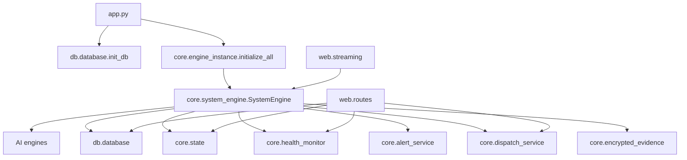

# Complete Architecture Map

This document is the architectural companion to [SENTRIX_MASTER_TECHNICAL_REPORT.md](../SENTRIX_MASTER_TECHNICAL_REPORT.md). It describes the verified active topology, the main coupling points, and the modules that currently control the live runtime.

## System Topology
SENTRIX runs as a single FastAPI process with one long-lived background processing thread. The live request layer, the MJPEG stream, and the WebSocket all read state produced by the frame-processing engine.

## Primary Runtime Clusters
- HTTP/UI layer: [app.py](../app.py), [web/routes.py](../web/routes.py), [web/streaming.py](../web/streaming.py), templates, and [static/js/app.js](../static/js/app.js)
- Processing layer: [core/system_engine.py](../core/system_engine.py) and the modules under [ai/](../ai)
- Persistence layer: [db/database.py](../db/database.py) and [db/models.py](../db/models.py)
- Escalation/evidence layer: [core/alert_service.py](../core/alert_service.py), [core/dispatch_service.py](../core/dispatch_service.py), [core/encrypted_evidence.py](../core/encrypted_evidence.py), [hardware/siren.py](../hardware/siren.py)
- Shared state/health layer: [core/state.py](../core/state.py), [core/health_monitor.py](../core/health_monitor.py)

## Main Architecture Characteristics
- The orchestration core is centralized in [core/system_engine.py](../core/system_engine.py).
- Several services are module-level singletons.
- Async routes call synchronous helpers rather than queue-backed services.
- The repository is prototype-friendly, but it lacks hard production boundaries such as workers, queues, and private storage.
- [ai/system_engine.py](../ai/system_engine.py) is a legacy alternate implementation and is not part of the active graph.

## Coupling Hotspots
- Startup depends on `engine_instance.initialize_all()` being called from FastAPI lifespan before route access.
- The dashboard depends on the `state.get_ws_payload()` schema and the `/ws/threat` contract.
- The live MJPEG feed depends on `get_latest_frame()`.
- Dispatch pages depend on synchronous database reads.
- Evidence and alert artifacts are coupled to filesystem paths under `static/alerts` and `static/alerts/evidence`.

## Singleton Map
- [core/state.py](../core/state.py): `state = SystemState()`
- [core/health_monitor.py](../core/health_monitor.py): `health_monitor = HealthMonitor()`
- [core/alert_service.py](../core/alert_service.py): `alert_service = AlertService()`
- [core/dispatch_service.py](../core/dispatch_service.py): `dispatch_service = DispatchService()`
- [core/encrypted_evidence.py](../core/encrypted_evidence.py): `encrypted_evidence = EncryptedEvidence()`
- [core/engine_instance.py](../core/engine_instance.py): `_system_engine` plus the compatibility proxy `engine`

## Architectural Summary
SENTRIX is an always-on edge appliance. That is the correct product shape for the project’s current stage, but it also explains the main risks called out in the master report: scaling, observability, shutdown behavior, and security hardening all need work before production deployment.
