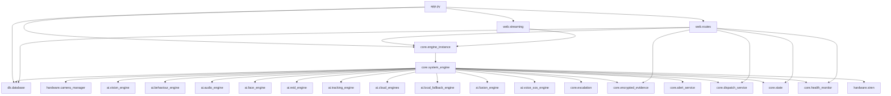

# Dependency Graph

This document shows the active dependency shape of the live app. It is aligned with the master report in [SENTRIX_MASTER_TECHNICAL_REPORT.md](../SENTRIX_MASTER_TECHNICAL_REPORT.md).

## Active Import Graph

## High Fan-Out Files
1. [core/system_engine.py](../core/system_engine.py): drives nearly every runtime subsystem.
2. [web/routes.py](../web/routes.py): mixes HTML, API, auth, upload, and websocket responsibilities.
3. [db/database.py](../db/database.py): persistence façade for multiple paths.
4. [ai/cloud_engines.py](../ai/cloud_engines.py): hub for multiple remote models and fallback state.

## High Fan-In Files
1. [db/database.py](../db/database.py): called by the engine, routes, and dispatch service.
2. [core/state.py](../core/state.py): read by routes, websocket, and dashboard JS; written by the engine.
3. [core/health_monitor.py](../core/health_monitor.py): read by routes and written by the engine.
4. [core/alert_service.py](../core/alert_service.py): used by the engine and dispatch service.

## Singleton Usage
- [core/state.py](../core/state.py): `state`
- [core/health_monitor.py](../core/health_monitor.py): `health_monitor`
- [core/alert_service.py](../core/alert_service.py): `alert_service`
- [core/dispatch_service.py](../core/dispatch_service.py): `dispatch_service`
- [core/encrypted_evidence.py](../core/encrypted_evidence.py): `encrypted_evidence`
- [core/engine_instance.py](../core/engine_instance.py): `_system_engine` and compatibility proxy `engine`

## Hidden Coupling
- The engine assumes camera tiling, cloud result shape, and dispatch DTO shape all remain stable.
- The dashboard assumes the WebSocket payload includes the current TCI, scores, health, and dispatch package fields.
- The web layer assumes synchronous database helpers and direct filesystem paths.

## Orphaned / Dead Files
- [core/sms_service.py](../core/sms_service.py)
- [core/timeline_register.py](../core/timeline_register.py)
- [ai/motion_engine.py](../ai/motion_engine.py)
- [ai/system_engine.py](../ai/system_engine.py)

## Architectural Conclusion
The current graph is workable for a single-device appliance, but it is tightly coupled. The main risk is not import cycles; it is that the runtime objects cannot be independently replaced or scaled without redesign.
