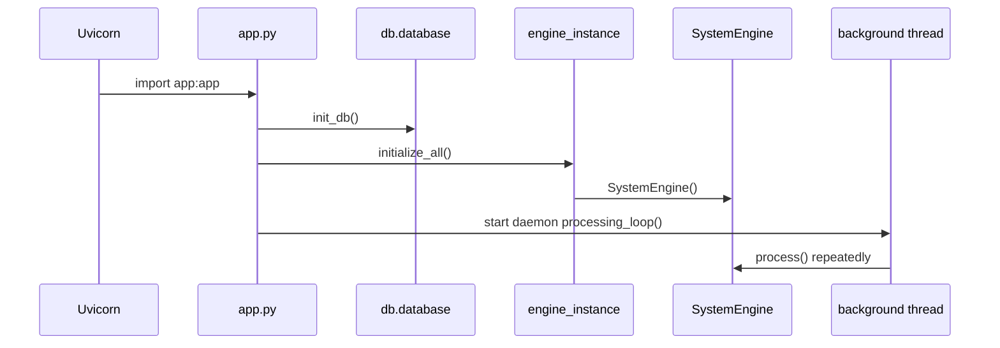
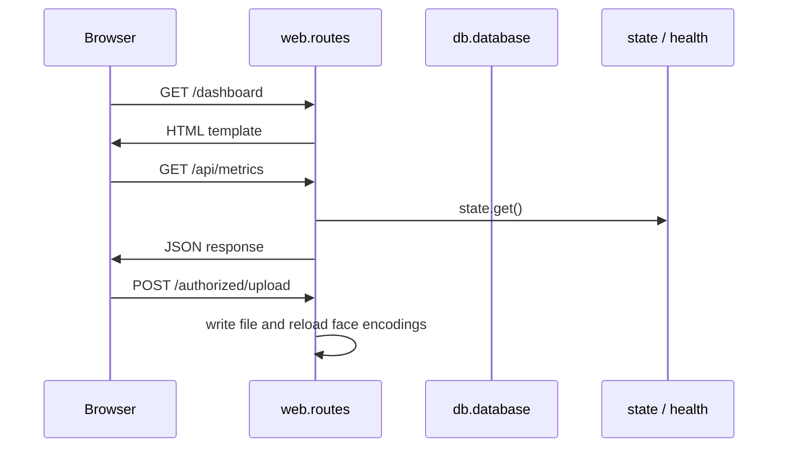

# Execution Flow Analysis

This document tracks the verified live runtime path from boot to shutdown. It should be read alongside [SENTRIX_MASTER_TECHNICAL_REPORT.md](../SENTRIX_MASTER_TECHNICAL_REPORT.md).

## 1. App Startup Lifecycle
### Entry point
- [app.py](../app.py) is the executable entrypoint.
- It imports dotenv, the database layer, the engine singleton, the page router, and the streaming router.
- It starts a daemon processing thread inside FastAPI lifespan startup.

### Startup sequence

### Verified call order
1. `uvicorn.run("app:app")`
2. FastAPI lifespan starts.
3. `db.database.init_db()` runs.
4. `engine_instance.initialize_all()` constructs `SystemEngine`.
5. A daemon background thread starts `processing_loop()`.
6. The processing loop calls `get_system_engine()` and then `SystemEngine.process()` forever.

### Lifecycle observations
- Startup work is synchronous.
- There is no graceful join/stop path for the daemon thread.
- Camera, audio, and voice services are started eagerly inside the engine constructor.

## 2. Request Lifecycle
### HTML and route flow
- `/` redirects to `/dashboard`.
- `/login` renders and submits a password form.
- Protected pages read the `session_token` cookie.
- `/authorized/upload` writes an uploaded image, then reloads face encodings.

### API flow
- `/api/metrics` returns the current live state snapshot.
- `/api/health` returns subsystem availability.
- `/api/dispatch/latest` returns the most recent pending dispatch package.
- `/api/dispatch/{id}/send/{authority}` sends a package using a worker-thread wrapper.

### Request flow diagram

## 3. WebSocket Lifecycle
### Entry point
- `/ws/threat` in [web/routes.py](../web/routes.py).

### Sequence
1. Accept the socket.
2. Loop forever.
3. Serialize `state.get_ws_payload()`.
4. Send the JSON text frame.
5. Sleep 0.5 seconds.

### Risks
- Each client gets its own polling loop.
- Backpressure from slow clients can stall the coroutine.
- The WebSocket is unauthenticated in the active code.

## 4. Frame Processing Lifecycle
### Entry point
- [core/system_engine.py](../core/system_engine.py) `process()`.

### Sequence
1. Read frames from the camera manager.
2. Tile them into one combined frame.
3. Run YOLO detection and motion scoring.
4. Run behaviour classification.
5. Run face authorization.
6. Run tracking and ReID.
7. Run audio detection.
8. Run cloud inference every 10 frames.
9. Fuse scores into a TCI result.
10. Apply voice override.
11. Execute escalation actions.
12. Log the event.
13. Update shared state.
14. Draw the HUD and cache the annotated frame.

### Key risk
This is a single serialized hot path. Slow capture, inference, encryption, or DB writes directly increase end-to-end latency.

## 5. Escalation Lifecycle
### Trigger path
- `EscalationEngine.evaluate(level)` returns a declarative action plan.
- `SystemEngine.process()` then performs snapshot, evidence, SMS, siren, dispatch, and call actions.

### Order of operations
1. Snapshot.
2. Evidence.
3. SMS.
4. Siren.
5. Dispatch package.
6. Voice call.
7. Event log.

### Important property
The actions are sequential and inline. That is acceptable for the prototype, but it is one of the main reasons the app needs queues or workers before production use.

## 6. Shutdown Lifecycle
- No explicit teardown block is present in FastAPI lifespan.
- Daemon threads exit with the process.
- Cameras, microphone resources, and background listeners are not joined or shut down explicitly.

## 7. Practical Conclusion
The runtime is stable enough for local use and demos, but the execution flow is still tightly coupled. The next engineering step is to split capture, inference, escalation, and persistence into separately managed services.
