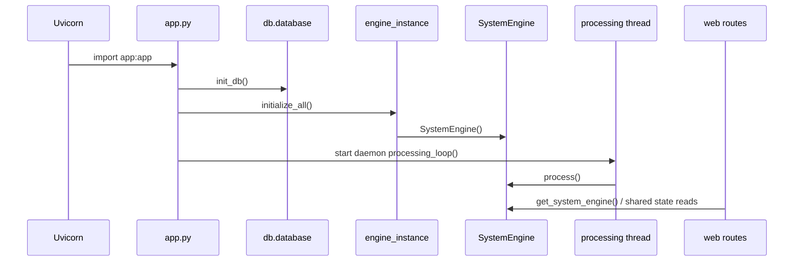
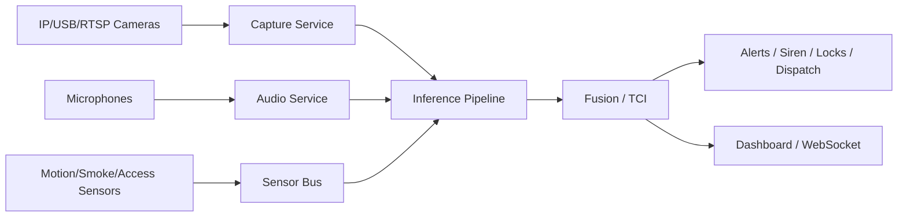

# SENTRIX Master Technical Report

Date of audit: 2026-08-07

## Table of Contents
1. [Audit Scope and Method](#audit-scope-and-method)
2. [Project Definition](#project-definition)
3. [Architecture Overview](#architecture-overview)
4. [Runtime Execution Flow](#runtime-execution-flow)
5. [Repository Inventory](#repository-inventory)
6. [API Map](#api-map)
7. [Backend Audit](#backend-audit)
8. [Frontend Audit](#frontend-audit)
9. [AI System Audit](#ai-system-audit)
10. [TCI and Decision Engine Audit](#tci-and-decision-engine-audit)
11. [Database Audit](#database-audit)
12. [Security Audit](#security-audit)
13. [Performance Audit](#performance-audit)
14. [Unused Code and Legacy Surface](#unused-code-and-legacy-surface)
15. [Documentation Audit](#documentation-audit)
16. [Feature Completeness Matrix](#feature-completeness-matrix)
17. [Hardware Readiness](#hardware-readiness)
18. [Deployment Audit](#deployment-audit)
19. [Technical Debt Register](#technical-debt-register)
20. [Roadmap](#roadmap)
21. [Final CTO Verdict](#final-cto-verdict)
22. [Appendix: Evidence Artifacts](#appendix-evidence-artifacts)

## Audit Scope and Method

This report is based on direct repository inspection of the active source tree, generated assets, model bundles, documentation, and supporting scripts. The active runtime path was traced from the FastAPI entrypoint through the engine singleton, AI modules, persistence layer, UI routes, MJPEG streaming, and supporting services. Legacy and duplicate files were checked for reference usage and compared against the active graph.

Important caveat: the repository contains large generated artifact sets and binary assets. Their contents were not byte-for-byte reverse engineered; instead, they were inventoried as runtime artifacts by directory, filename pattern, and file count. That is the correct level of inspection for pre-trained models, image outputs, and database files.

## Project Definition

SENTRIX is a single-host, edge-first multimodal home security system. It ingests camera feeds, optional audio, optional voice commands, optional cloud threat inference, and optional face enrollment data, then fuses those inputs into a 5-level Threat Confidence Index (TCI). The system escalates through snapshots, encrypted evidence, SMS, siren activation, dispatch packages, and voice calls.

Primary user groups:
- Home / small-premises operators who want an always-on local security appliance.
- Capstone evaluators who need a demonstrable AI security pipeline with a dashboard.
- Future hardware integrators who want cameras, microphones, sirens, and access control tied into one system.

Intended deployment today:
- Local Windows or Linux workstation / edge box.
- Single Python process with a background processing thread.
- FastAPI web UI on `http://127.0.0.1:8000`.
- SQLite persistence and filesystem-based evidence storage.

Long-term vision implied by the code and docs:
- Multi-camera edge appliance.
- Hardware-integrated access and alerting system.
- Cloud-hybrid threat inference with local fallback.
- More durable production architecture with worker isolation, object storage, and stronger auth.

## Architecture Overview

The live system is a monolith with a heavy orchestration core.

```mermaid
flowchart TD
    A[app.py] --> B[db.database.init_db]
    A --> C[core.engine_instance.initialize_all]
    A --> D[FastAPI routes]
    C --> E[core.system_engine.SystemEngine]
    E --> F[hardware.camera_manager.CameraManager]
    E --> G[ai.vision_engine]
    E --> H[ai.behaviour_engine]
    E --> I[ai.audio_engine]
    E --> J[ai.face_engine]
    E --> K[ai.tracking_engine]
    E --> L[ai.reid_engine]
    E --> M[ai.cloud_engines]
    E --> N[ai.fusion_engine]
    E --> O[ai.voice_sos_engine]
    E --> P[core.escalation]
    E --> Q[core.alert_service]
    E --> R[core.dispatch_service]
    E --> S[core.encrypted_evidence]
    E --> T[core.state]
    E --> U[core.health_monitor]
    E --> V[hardware.siren]
    D --> W[templates + static/js/app.js]
    D --> X[/api metrics, health, dispatch]
    D --> Y[/ws/threat]
    D --> Z[/video MJPEG]
```

System characteristics:
- The active pipeline is centered on `core/system_engine.py`.
- `state`, `health_monitor`, `alert_service`, `dispatch_service`, `encrypted_evidence`, and the `SystemEngine` instance are module-level singletons.
- The app is optimistic and fallback-friendly, but not yet production-isolated.
- The repository includes a legacy alternate engine in `ai/system_engine.py`, but it is not wired into the active runtime path and references symbols that are not present in the active graph.

## Runtime Execution Flow

### Startup sequence
1. Uvicorn imports `app.py` and instantiates `FastAPI`.
2. `load_dotenv()` runs early in `app.py` and again in several service modules.
3. FastAPI lifespan startup calls `db.database.init_db()`.
4. Lifespan startup calls `core.engine_instance.initialize_all()`.
5. `initialize_all()` constructs a single `SystemEngine`.
6. `SystemEngine.__init__()` eagerly constructs cameras, AI engines, fusion, alerting, evidence, dispatch, health, and siren services.
7. A daemon thread starts `processing_loop()`.
8. The loop repeatedly calls `SystemEngine.process()` at roughly 30 FPS, with internal inference skipping to reduce load.

### Per-frame processing pipeline
1. Collect frames from `CameraManager`.
2. Tile one or more frames into a single combined frame.
3. Run YOLO person detection and motion scoring.
4. Run behaviour classification from track history.
5. Run face authorization.
6. Update tracking and ReID identities.
7. Run cached audio classification.
8. Run cached cloud threat inference every 10 frames.
9. Apply local fallback weapon heuristic if cloud failures accumulate.
10. Build the score dictionary.
11. Fuse into a TCI result.
12. Apply temporal smoothing.
13. Apply voice SOS override if the listener heard a trigger.
14. Evaluate escalation actions.
15. Save snapshot, evidence, SMS, siren, dispatch package, and voice call as needed.
16. Log qualifying events to SQLite.
17. Update shared state for the dashboard and WebSocket.
18. Render HUD overlays onto the annotated frame.

### Shutdown behavior
- There is no explicit graceful teardown path for the daemon thread, camera handles, audio listener, or voice listener.
- Shutdown is best-effort and process-bound, not lifecycle-managed.

### Execution diagram


## Repository Inventory

### Root files
| File | Purpose | Status |
|---|---|---|
| [app.py](app.py) | FastAPI entrypoint and background processing bootstrap | Active |
| [README.md](README.md) | High-level setup and architecture intro | Active, but too short for current scope |
| [requirements.txt](requirements.txt) | Python dependency list | Active |
| [smoke_test.py](smoke_test.py) | Local hardware/config sanity test | Active |
| [.gitignore](.gitignore) | Ignores Python, env, logs, DB, and IDE artifacts | Active |
| [.env.example](.env.example) | Local config template | Active |
| [.env](.env) | Local secret/config file present in workspace | Sensitive local artifact |
| [sentrix.db](sentrix.db) | SQLite database file | Generated runtime artifact |
| [crash.log](crash.log) | Local log artifact | Generated runtime artifact |
| [yolov8l.pt](yolov8l.pt) | Large YOLO model artifact | Data/model asset |
| [yolov8n.pt](yolov8n.pt) | Small YOLO model artifact | Data/model asset |

### `ai/` source files
| File | Purpose | Status |
|---|---|---|
| [ai/audio_engine.py](ai/audio_engine.py) | Background audio heuristic detector | Active |
| [ai/behaviour_engine.py](ai/behaviour_engine.py) | Track-motion heuristic behaviour classifier | Active |
| [ai/cloud_engines.py](ai/cloud_engines.py) | Roboflow-backed cloud threat inference and fallback | Active |
| [ai/face_engine.py](ai/face_engine.py) | Authorized face recognition and hot reload | Active |
| [ai/fusion_engine.py](ai/fusion_engine.py) | TCI fusion and level mapping | Active |
| [ai/local_fallback_engine.py](ai/local_fallback_engine.py) | Local heuristic weapon fallback | Active |
| [ai/motion_engine.py](ai/motion_engine.py) | Simple unused motion helper | Stale / unused |
| [ai/reid_engine.py](ai/reid_engine.py) | Person ReID and global ID assignment | Active |
| [ai/system_engine.py](ai/system_engine.py) | Legacy alternate orchestrator | Broken / dead branch |
| [ai/tracking_engine.py](ai/tracking_engine.py) | DeepSORT wrapper / passthrough tracker | Active |
| [ai/vision_engine.py](ai/vision_engine.py) | YOLO person detection and frame-diff motion scoring | Active |
| [ai/voice_sos_engine.py](ai/voice_sos_engine.py) | Vosk voice trigger listener | Active, optional |

### `core/` source files
| File | Purpose | Status |
|---|---|---|
| [core/alert_service.py](core/alert_service.py) | Twilio SMS/call alerts and snapshot saving | Active |
| [core/dispatch_service.py](core/dispatch_service.py) | Emergency dispatch package creation/sending | Active |
| [core/encrypted_evidence.py](core/encrypted_evidence.py) | AES-256-GCM encrypted evidence writer | Active |
| [core/engine_instance.py](core/engine_instance.py) | Singleton `SystemEngine` holder | Active |
| [core/escalation.py](core/escalation.py) | Declarative escalation policy by level | Active |
| [core/health_monitor.py](core/health_monitor.py) | Subsystem health flags | Active |
| [core/sms_service.py](core/sms_service.py) | Legacy direct Twilio wrapper | Stale / unused |
| [core/state.py](core/state.py) | Live dashboard state snapshot | Active |
| [core/system_engine.py](core/system_engine.py) | Main per-frame orchestrator | Active, high-risk hotspot |
| [core/timeline_register.py](core/timeline_register.py) | Legacy timeline helper | Stale / unused |

### `db/` source files
| File | Purpose | Status |
|---|---|---|
| [db/__init__.py](db/__init__.py) | Package marker | Empty |
| [db/database.py](db/database.py) | SQLite engine and CRUD helpers | Active |
| [db/init_db.py](db/init_db.py) | DB bootstrap script | Active |
| [db/models.py](db/models.py) | ORM models for events, dispatch packages, and faces | Active |

### `hardware/` source files
| File | Purpose | Status |
|---|---|---|
| [hardware/camera.py](hardware/camera.py) | Single camera wrapper with blank-frame fallback | Active |
| [hardware/camera_manager.py](hardware/camera_manager.py) | Multi-camera manager | Active |
| [hardware/siren.py](hardware/siren.py) | Platform-aware siren/beep helper | Active |

### `web/` source files
| File | Purpose | Status |
|---|---|---|
| [web/routes.py](web/routes.py) | HTML, API, auth, upload, dispatch, WebSocket routes | Active, very high risk |
| [web/streaming.py](web/streaming.py) | MJPEG video stream endpoint | Active |

### `templates/`
| File | Purpose | Status |
|---|---|---|
| [templates/base.html](templates/base.html) | Common shell and nav | Active |
| [templates/dashboard.html](templates/dashboard.html) | Main command dashboard | Active |
| [templates/live.html](templates/live.html) | Live camera page | Active, but WS scheme is hard-coded to `ws://` |
| [templates/events.html](templates/events.html) | Event log page | Active |
| [templates/alerts.html](templates/alerts.html) | Alert snapshot gallery | Active |
| [templates/evidence.html](templates/evidence.html) | Evidence vault page | Active |
| [templates/dispatch.html](templates/dispatch.html) | Dispatch package page | Active |
| [templates/authorized.html](templates/authorized.html) | Access control / face enrollment page | Active |
| [templates/login.html](templates/login.html) | Login page | Active |

### `static/`
| File / folder | Purpose | Status |
|---|---|---|
| [static/css/style.css](static/css/style.css) | Dashboard and page styling | Active |
| [static/js/app.js](static/js/app.js) | Dashboard WebSocket client and UI updater | Active |
| [static/js/enroll.js](static/js/enroll.js) | Stale enrollment script referencing obsolete route | Unused / broken |
| [static/sounds/siren.wav](static/sounds/siren.wav) | Local siren audio asset | Asset |
| [static/authorized_faces/hello.jpg](static/authorized_faces/hello.jpg) | Enrolled face example asset | Asset |
| static/alerts/ | Generated alert snapshots | Runtime artifact set |
| static/alerts/evidence/ | Generated encrypted evidence bundles | Runtime artifact set |
| static/faces/ | Empty asset directory | Placeholder |

### `models/`
| File / folder | Purpose | Status |
|---|---|---|
| [models/tci_xgboost.json](models/tci_xgboost.json) | Fusion model artifact | Asset |
| [models/yolov8n.pt](models/yolov8n.pt) | YOLO nano model copy | Asset |
| [models/yolov8l.pt](yolov8l.pt) | YOLO large model at repo root | Asset |
| models/vosk-model/ | Bundled Vosk speech model directory | Asset bundle |

### `scripts/`
| File | Purpose | Status |
|---|---|---|
| [scripts/demo_validator.py](scripts/demo_validator.py) | Live demo validation script | Active, but assumes current routes and server | 
| [scripts/evaluation_runner.py](scripts/evaluation_runner.py) | Synthetic evaluation helper | Prototype |
| [scripts/train_tci.py](scripts/train_tci.py) | Synthetic XGBoost training script | Prototype |

### `Doc/`
| File | Purpose | Status |
|---|---|---|
| [Doc/AI_PIPELINE_ANALYSIS.md](Doc/AI_PIPELINE_ANALYSIS.md) | AI pipeline analysis | Active reference |
| [Doc/COMPLETE_ARCHITECTURE_MAP.md](Doc/COMPLETE_ARCHITECTURE_MAP.md) | Architecture map | Active reference |
| [Doc/CONCURRENCY_AUDIT.md](Doc/CONCURRENCY_AUDIT.md) | Concurrency audit | Active reference |
| [Doc/DATABASE_AUDIT.md](Doc/DATABASE_AUDIT.md) | Database audit | Active reference |
| [Doc/DEPENDENCY_GRAPH.md](Doc/DEPENDENCY_GRAPH.md) | Dependency graph | Active reference |
| [Doc/EXECUTION_FLOW_ANALYSIS.md](Doc/EXECUTION_FLOW_ANALYSIS.md) | Execution flow analysis | Active reference |
| [Doc/PRODUCTION_GAP_ANALYSIS.md](Doc/PRODUCTION_GAP_ANALYSIS.md) | Production gap analysis | Active reference |
| [Doc/REFACTOR_STRATEGY.md](Doc/REFACTOR_STRATEGY.md) | Refactor roadmap | Active reference |
| [Doc/SECURITY_AUDIT.md](Doc/SECURITY_AUDIT.md) | Security audit | Active reference |
| [Doc/TECHNICAL_DEBT_REGISTER.md](Doc/TECHNICAL_DEBT_REGISTER.md) | Technical debt register | Active reference |

### Generated artifact inventory
- `static/alerts/` contains 1,472 generated JPEG snapshots at audit time.
- `static/alerts/evidence/` contains 798 generated evidence artifacts at audit time, consisting of `.enc` encrypted blobs and `.json` metadata sidecars.
- `models/vosk-model/vosk-model-small-en-us-0.15/` is a bundled offline speech model tree with multiple subdirectories and binary files.
- `sentrix.db` is a live SQLite database snapshot in the repository root.
- `crash.log` is a local runtime log artifact in the repository root.
- `__pycache__/` directories are present and should remain ignored.

## API Map

### HTML routes
| Route | Method | Purpose | Auth | Notes |
|---|---|---|---|---|
| `/` | GET | Redirect to dashboard | Implicit | Active |
| `/login` | GET | Render login page | None | Active |
| `/login` | POST | Authenticate with password | None | Stores plaintext password value in cookie |
| `/logout` | GET | Clear cookie and redirect | None | Active |
| `/dashboard` | GET | Main command dashboard | Cookie-based | Active |
| `/live` | GET | Live camera page | Cookie-based | Active |
| `/events` | GET | Event log page | Cookie-based | Active |
| `/alerts` | GET | Alert gallery | Cookie-based | Active |
| `/evidence` | GET | Evidence vault | Cookie-based | Active |
| `/dispatch` | GET | Dispatch packages | Cookie-based | Active |
| `/authorized` | GET | Face enrollment page | Cookie-based | Active |

### Mutating routes
| Route | Method | Purpose | Auth | Notes |
|---|---|---|---|---|
| `/authorized/upload` | POST | Upload face image and hot reload encodings | No auth guard in code | High risk |
| `/api/authorized/{filename}` | DELETE | Delete enrolled face image | No auth guard in code | High risk |
| `/api/dispatch/{dispatch_id}/send/{authority}` | POST | Send dispatch package via Twilio | No auth guard in code | Uses worker thread wrapper |

### Read routes
| Route | Method | Purpose | Auth | Notes |
|---|---|---|---|---|
| `/api/metrics` | GET | Live state snapshot | None | Exposes operational state |
| `/api/health` | GET | Subsystem health | None | Exposes operational state |
| `/api/dispatch/latest` | GET | Latest pending dispatch package | None | Exposes emergency data |
| `/video` | GET | MJPEG live video stream | None | High bandwidth / privacy risk |

### WebSocket
| Route | Method | Purpose | Auth | Notes |
|---|---|---|---|---|
| `/ws/threat` | WS | Push live state every 0.5s | None | One loop per client |

### API consumers
- `static/js/app.js` consumes `/ws/threat`, `/api/health`, and `/api/dispatch/{id}/send/{authority}`.
- `templates/live.html` creates its own WebSocket connection.
- `templates/dispatch.html` calls `/api/dispatch/{id}/send/{authority}`.
- `templates/authorized.html` calls `/authorized/upload` and `/api/authorized/{filename}`.
- `scripts/demo_validator.py` exercises `/api/metrics`, `/api/health`, `/authorized/upload`, `/api/authorized/{filename}`, `/api/dispatch/{id}/send/{authority}`, and the WebSocket.

## Backend Audit

### Active backend control flow
- `app.py` is the real bootstrap file.
- `core/engine_instance.py` holds the live `SystemEngine` singleton.
- `core/system_engine.py` owns capture, inference, fusion, escalation, persistence, and HUD rendering.
- `web/routes.py` mixes auth, uploads, page rendering, API endpoints, and the WebSocket in one router.
- `db/database.py` is the synchronous persistence façade.

### Confirmed issues
1. `SystemEngine.process()` is the monolithic hot path. It does capture, CPU/GPU work, cloud IO, disk writes, DB writes, and state updates in one function.
2. `app.py` starts a daemon thread with no shutdown join or stop event.
3. `AudioEngine` and `VoiceSosEngine` start background threads at construction time.
4. `web/routes.py` trusts `SENTRIX_PASSWORD` as the cookie value and does not use signed sessions.
5. `web/routes.py` writes uploaded files directly to disk using client-provided filenames.
6. `web/routes.py` exposes operational endpoints without authentication guards.
7. `db/database.py` uses synchronous SQLite with `check_same_thread=False`, which is acceptable for the prototype but not a production concurrency model.
8. `core/alert_service.py`, `core/dispatch_service.py`, and `core/encrypted_evidence.py` are all side-effect heavy and synchronous.

### Blocking / latency hot spots
- Camera read and reconnect logic in [hardware/camera.py](hardware/camera.py).
- YOLO inference in [ai/vision_engine.py](ai/vision_engine.py).
- Face recognition in [ai/face_engine.py](ai/face_engine.py).
- Cloud inference in [ai/cloud_engines.py](ai/cloud_engines.py).
- SQLite writes in [db/database.py](db/database.py).
- JPEG encoding and AES-GCM evidence writes in [core/encrypted_evidence.py](core/encrypted_evidence.py).

### Positive backend properties
- Defensive try/except blocks prevent many local failures from crashing the app.
- Health and state are lock-protected.
- Cloud and optional ML dependencies degrade gracefully to fallback mode.
- The processing pipeline caches scores to reduce inference cost.

## Frontend Audit

### What works
- The dashboard has a coherent control-console layout with live feed, gauge, score bars, audio status, cloud status, dispatch panel, and event log.
- `static/js/app.js` successfully consumes the live WebSocket state and updates the UI.
- `templates/authorized.html` uses the actual upload route and delete API route.

### Broken or stale paths
- `static/js/enroll.js` posts to `/authorized/add`, but the live backend route is `/authorized/upload`. The file is not referenced from any template and is stale.
- `templates/live.html` hard-codes `ws://` instead of choosing `ws://` or `wss://` based on page scheme. This breaks secure deployment.
- `static/js/app.js` assumes a dashboard DOM exists but gracefully guards many selectors; still, its role is dashboard-specific and the file is not modular.
- `templates/login.html` uses inline CSS instead of the main design system for some behavior.

### UX quality
- The dashboard is visually polished for a capstone/demo.
- It is not yet accessible or fully responsive in a production sense.
- There is no robust loading-state management, error-state UI, or operational toast system.

## AI System Audit

### Active AI engines
| Engine | Verdict | Evidence |
|---|---|---|
| Vision | Working prototype | YOLO load with fallback; person-only detection and frame-diff motion scoring |
| Behaviour | Working heuristic prototype | Speed, aspect-ratio, loitering heuristics |
| Audio | Working optional background service | One-second audio bursts, RMS/ZCR/FFT heuristic classification |
| Face | Working optional identity gate | Face-recognition based authorization with reloadable encodings |
| Tracking | Working wrapper | DeepSORT if installed, passthrough otherwise |
| ReID | Working fallback model | Color histogram fallback, torchreid optional |
| Cloud threat | Working optional cloud path | Roboflow remote models with 10-frame gating |
| Fusion | Working but prototype-grade | Static weights, hard overrides, EMA smoothing |
| Voice SOS | Working optional listener | Vosk trigger words in background thread |
| Local fallback weapon heuristic | Working fallback | OpenCV contour heuristic |

### Legacy / duplicated / inactive AI files
| File | Verdict | Reason |
|---|---|---|
| [ai/motion_engine.py](ai/motion_engine.py) | Unused helper | Overlapped by motion scoring in `VisionEngine`; no active reference found |
| [ai/system_engine.py](ai/system_engine.py) | Dead branch | References `SharedState`, `AsyncSessionLocal`, `EncryptedEvidenceManager`, and `VoiceSOSEngine`, which do not match the active graph |

### Model and scientific quality
- The vision, audio, behaviour, and fallback weapon logic are heuristic/prototype implementations, not scientifically validated production detectors.
- The cloud path relies on external model APIs and inherits their model quality, latency, and availability.
- ReID uses a fallback color histogram if torchreid is absent, which is only a coarse approximation.
- Face recognition is useful for a capstone but needs stronger enrollment, anti-spoofing, and access controls for real deployments.

### AI architecture notes
- The active pipeline is intentionally modular, but its execution is synchronous and serialized.
- Most AI engines are instantiated eagerly in `SystemEngine.__init__()`.
- Several engines maintain background threads or internal history state, so shutdown and memory growth need attention.

## TCI and Decision Engine Audit

### Active policy
The TCI path is implemented in [ai/fusion_engine.py](ai/fusion_engine.py) and invoked from [core/system_engine.py](core/system_engine.py).

### How it works
1. Hard override for fire confidence >= 0.70 returns Level 5.
2. Hard override for weapon confidence >= 0.70 returns Level 5.
3. Weapon confidence >= 0.50 or intrusion >= 0.75 returns Level 4.
4. Authorized users with no weapon confidence are forced to Level 1.
5. Otherwise the engine uses XGBoost if the model is present; else it falls back to static weighted fusion.
6. Unauthorized or suspicious behavior adds contextual boosters.
7. EMA smoothing is applied to the raw TCI.
8. The smoothed TCI is mapped to 5 discrete levels.

### Verdict
- The implementation broadly matches the intended capstone design: multi-modal fusion, hard safety overrides, temporal smoothing, and discrete escalation levels.
- It is not mathematically polished enough for scientific claims of calibrated probability.
- Static weights and heuristic booster values are hand-tuned and should be treated as policy constants, not learned truth.

### Specific behaviors to preserve
- Authorized-user override is intentional.
- Weapon and fire overrides must bypass the normal fusion path.
- Temporal smoothing prevents level flicker.
- The processing loop further suppresses side effects for authorized users unless weapon confidence is high.

## Database Audit

### Schema
Active tables in [db/models.py](db/models.py):
- `AuthorizedPerson`
- `EventLog`
- `DispatchPackageModel`

### Current design
- SQLite database stored at `sentrix.db`.
- SQLAlchemy session per helper call.
- Synchronous writes and reads.
- Helper functions return dict-shaped DTOs for routes.

### Observed gaps
- No indexes are declared for hot read/write predicates.
- No retention policy is implemented.
- JSON payloads are stored as text instead of a queryable JSON type.
- SQLite single-writer behavior will become a bottleneck under sustained event generation.

### DB interaction map
- `SystemEngine.process()` logs events for level 2+ incidents.
- `DispatchService.create_package()` stores dispatch packages.
- `DispatchService.dispatch()` updates dispatch status after sending.
- Routes read recent events, latest pending dispatch, and all dispatch packages.

### Verdict
- Good prototype schema.
- Not production-grade for concurrency, retention, or analytics.

## Security Audit

### Critical findings
1. Login auth is password-as-cookie. The cookie value is the password itself.
2. The auth check trusts a raw cookie comparison rather than a signed session.
3. There is a default password fallback in the login flow if `.env` is missing.
4. Face uploads are not protected by auth and are written directly to disk.
5. Uploaded filenames are not fully normalized against traversal or malicious content.
6. Operational endpoints, metrics, health, WebSocket, and video are exposed without explicit auth.
7. Evidence is stored in filesystem paths that are directly web-accessible.
8. Evidence encryption uses an ephemeral fallback key when no env key is supplied, which makes evidence continuity fragile across restarts.

### Additional concerns
- No CSRF protection.
- No request throttling or abuse controls.
- No signed URLs for evidence access.
- Twilio alerting could be abused for cost or nuisance if an attacker reaches the trigger path.
- Secrets live in environment files and local workspace artifacts.

### Security posture verdict
The repository is acceptable for a demo or capstone prototype, but it does not meet production security expectations for a real security product.

## Performance Audit

### Measured / designed behavior
- Processing loop targets about 30 FPS but skips ML inference on most frames using `inference_skip = 6`.
- Cloud inference only runs every 10 frames.
- Audio and voice are moved to background threads.
- State updates include latency average and p95 tracking.

### Main bottlenecks
- Camera reads.
- YOLO detection.
- Face recognition.
- DeepSORT / ReID.
- Cloud API round-trips.
- SQLite writes.
- JPEG encoding and AES-GCM evidence writes.

### Risk summary
- The system can hold up for a demo or a single edge device.
- It will not scale linearly across multiple cameras or long alert storms without queueing and worker isolation.

### Useful performance signals already present
- `latency_avg`
- `latency_p95`
- `fps`
- `cloud_online`
- `mic_available`, `camera_available`, `yolo_available`, `face_available`

## Unused Code and Legacy Surface

### Confirmed stale or unused files
| File | Why it exists | Reference status | Action |
|---|---|---|---|
| [ai/motion_engine.py](ai/motion_engine.py) | Legacy motion helper before motion was folded into vision | No active import found | Archive or delete |
| [core/sms_service.py](core/sms_service.py) | Older Twilio wrapper before `alert_service` became canonical | No active import found | Archive or delete |
| [core/timeline_register.py](core/timeline_register.py) | Older timeline tracking helper | No active import found | Archive or delete |
| [ai/system_engine.py](ai/system_engine.py) | Legacy orchestrator | Not wired into active startup path | Delete or quarantine |
| [static/js/enroll.js](static/js/enroll.js) | Stale client script | Not referenced by templates; wrong route `/authorized/add` | Delete or replace |

### Generated / runtime-only artifacts
| Artifact | Why it exists | Reference status | Action |
|---|---|---|---|
| [sentrix.db](sentrix.db) | Local SQLite runtime database | Generated by app | Keep out of source control |
| [crash.log](crash.log) | Local runtime log | Generated by app | Keep out of source control |
| [static/alerts/](static/alerts) | Saved alert snapshots | Active output folder | Retain with lifecycle policy |
| [static/alerts/evidence/](static/alerts/evidence) | Encrypted evidence bundles | Active output folder | Retain with lifecycle policy |
| `__pycache__/` and nested cache dirs | Python bytecode cache | Generated | Ignore |

### Unused / suspicious documentation drift
The documentation set is internally valuable, but several docs describe old names and legacy paths. That is useful as historical evidence, but it also means the doc set needs consolidation once the codebase is stabilized.

## Documentation Audit

### Strong documentation areas
- The repo has unusually good internal analysis docs for architecture, execution flow, concurrency, security, production gaps, dependency graph, and refactor strategy.
- The docs make the intended future architecture explicit.

### Inconsistencies and outdated terminology
- Legacy references appear to `VoiceSOSEngine`, `SharedState`, `EncryptedEvidenceManager`, and alternate event shapes in the docs and stale modules.
- The code now uses `VoiceSosEngine`, `SystemState`, and `EncryptedEvidence`.
- The README is useful, but it is too short for the amount of functionality now present.

### Missing documentation
- No deployment guide.
- No Docker or Compose guide.
- No API contract document for the WebSocket payload or dashboard schema.
- No shutdown / operations runbook.
- No retention policy documentation.
- No hardware integration guide.

### Verdict
The repository is heavily documented, but the documentation set is fragmented and should be condensed into a single canonical engineer-facing spec once the system stabilizes.

## Feature Completeness Matrix

| Subsystem | Status | Completion | Rationale |
|---|---|---:|---|
| App bootstrap | 🟢 Complete | 90% | Starts cleanly, initializes DB and engine, but lacks graceful shutdown |
| Camera capture | 🟡 Partial | 70% | Multi-camera support exists, but no per-camera worker isolation or timeout control |
| Vision detection | 🟡 Partial | 75% | YOLO integration works with fallback, but scientific validation is limited |
| Motion analysis | 🟡 Partial | 60% | Basic frame-diff exists; no dedicated optimized pipeline |
| Behaviour detection | 🟡 Partial | 65% | Heuristic and useful, but not validated |
| Face authorization | 🟡 Partial | 75% | Works, but upload/security/model hardening is weak |
| ReID / tracking | 🟡 Partial | 70% | Functional, but gallery growth and fallback quality need work |
| Audio detection | 🟡 Partial | 60% | Works as optional prototype, but thread cleanup and accuracy are limited |
| Voice SOS | 🟡 Partial | 55% | Functional optional feature, but noisy and lifecycle-heavy |
| Cloud threat inference | 🟡 Partial | 65% | Works in demo mode with API key; latency and reliability are concerns |
| Fusion / TCI | 🟢 Mostly complete | 85% | Active and coherent, but not rigorously calibrated |
| Escalation | 🟡 Partial | 70% | SMS, call, siren, evidence, dispatch exist, but are synchronous and fragile |
| Evidence handling | 🟡 Partial | 65% | Encryption exists, but key management and storage model need hardening |
| Database | 🟡 Partial | 60% | Simple and functional, but not scalable |
| Dashboard UI | 🟢 Mostly complete | 85% | Strong demo UI, but security and responsive polish are incomplete |
| Access control UI | 🟡 Partial | 70% | Upload/delete flows exist, but auth and route hygiene are weak |
| APIs/WebSocket | 🟡 Partial | 70% | Functional, but unauthenticated and contract-light |
| Hardware readiness | 🔴 Missing | 35% | Only the basic camera/mic/siren path exists |
| Deployment readiness | 🔴 Missing | 25% | No Docker, Compose, CI/CD, or IaC |
| Observability | 🔴 Missing | 20% | Print-heavy runtime with minimal metrics |

Estimated overall implementation completeness: 68% for capstone/demo use, 28% for production readiness.

## Hardware Readiness

### Supported today
- USB / webcam input via OpenCV integer camera index.
- RTSP / HTTP stream input if OpenCV can open the URL.
- Microphone input if `sounddevice` is installed and an input device exists.
- Local siren sound output via `winsound` on Windows or fallback beep path on other platforms.

### Not yet properly abstracted
- ONVIF discovery.
- NVR / DVR integration.
- GPIO / relay modules.
- RFID readers.
- Biometric access control beyond face recognition.
- Smoke detectors and motion sensors as distinct device classes.
- MQTT integration.
- UPS monitoring.
- PoE health and camera power telemetry.

### Required abstraction layers
1. Device discovery layer.
2. Device health layer.
3. Unified capture interface.
4. Hardware command / actuator interface.
5. Offline / degraded mode coordinator.
6. Retry and watchdog layer.

### Recommended hardware architecture


## Deployment Audit

### What exists
- A local FastAPI app that can be launched with `python app.py`.
- A smoke test for local validation.
- Synthetic evaluation and demo validation scripts.
- Environment-variable-based configuration.

### What is missing
- Dockerfile.
- Docker Compose file.
- CI/CD pipeline.
- IaC for cloud deployment.
- Runtime health probe strategy.
- Backup and retention automation.
- Release artifact packaging.
- Graceful shutdown handling.

### Production readiness verdict
Not ready for production deployment as-is.

## Technical Debt Register

### Critical
1. Cookie-password auth and missing session signing.
2. Unauthenticated file upload and telemetry exposure.
3. Daemon-based shutdown loss and thread cleanup gaps.
4. Synchronous DB and side effects in the async web path.

### High
1. Monolithic `SystemEngine` hot path.
2. Inline cloud, Twilio, evidence, and dispatch IO.
3. Missing structured logging and metrics.
4. Global state coupling across web and engine code.

### Medium
1. SQLite single-writer ceiling.
2. Unbounded evidence and alert artifact growth.
3. ReID gallery growth.
4. Cloud frame skipping and stale results.
5. Legacy dead engine branch.

### Low
1. WebSocket / dashboard duplication.
2. Mixed naming conventions in legacy docs and code.
3. Small helper modules with no active references.

## Roadmap

### Current state
- Capstone/demo capable.
- Single-host, prototype-friendly, but fragile.

### Capstone complete
- Tighten auth and uploads.
- Add a single canonical API contract.
- Stabilize event logs and evidence flows.
- Clean up dead files and stale scripts.

### Demo stable
- Add shutdown cleanup.
- Harden WebSocket and live feed behavior.
- Make the enrollment path reliable.
- Reduce obvious route and UI mismatches.

### Production ready
- Replace cookie-password auth.
- Move to async or queued DB handling.
- Externalize evidence storage.
- Add structured logs, metrics, and alerting.
- Introduce retention and backup policies.

### Enterprise ready
- Split capture, inference, fusion, and side effects into workers.
- Add object storage and private evidence access.
- Add multi-tenant boundaries and RBAC.
- Add observability, SLOs, and operator tooling.

### Hardware integrated
- Add device abstraction layers.
- Add discovery, health, and recovery.
- Support locks, sirens, sensors, and NVRs.

### Multi-camera deployment
- Per-camera workers or bounded queues.
- Load-aware routing.
- Per-source health and throughput reporting.

### Edge AI deployment
- Local worker scheduling.
- GPU-aware model placement.
- Offline-first scoring with cloud optionality.

### Cloud hybrid deployment
- Async cloud inference worker.
- Queue-backed side effects.
- Signed access to evidence.
- Managed identity / secrets manager integration.

## Final CTO Verdict

### Scores
| Category | Score / 10 |
|---|---:|
| Architecture | 4.0 |
| Backend | 4.5 |
| Frontend | 7.0 |
| AI | 6.0 |
| Security | 2.0 |
| Performance | 4.0 |
| Scalability | 2.5 |
| Documentation | 7.5 |
| Maintainability | 3.5 |
| Hardware Readiness | 3.0 |
| Production Readiness | 2.5 |
| Capstone Readiness | 7.5 |
| Investor Readiness | 3.0 |

Overall technical score: 4.3 / 10 for production, 7.1 / 10 for capstone/demo.

### Top 20 highest-priority actions before feature-complete
1. Replace password-as-cookie auth with signed sessions and CSRF protection.
2. Require auth on upload, metrics, health, WebSocket, video, and dispatch routes.
3. Sanitize uploaded filenames and store uploads outside the web root.
4. Add graceful shutdown for the processing thread, camera handles, audio thread, and voice thread.
5. Split `SystemEngine` into capture, inference, fusion, and side-effect services.
6. Move SMS, calls, evidence, and dispatch into queue-backed workers.
7. Replace SQLite with a more scalable database or at least add proper indexes and repository abstractions.
8. Add structured logs, trace IDs, and operational metrics.
9. Add retention and cleanup for snapshots, evidence, and logs.
10. Make the live WebSocket and MJPEG feed contract explicit and versioned.
11. Fix the stale `static/js/enroll.js` client path mismatch.
12. Remove or quarantine `ai/system_engine.py`.
13. Remove or archive `core/sms_service.py`, `core/timeline_register.py`, and `ai/motion_engine.py` if no longer needed.
14. Harden evidence key management with persistent rotation and versioning.
15. Add deployment packaging: Docker, Compose, and CI/CD.
16. Add access control for dashboard, evidence, and enrollment flows.
17. Add health and failure recovery for cameras, audio, cloud, and storage.
18. Add hardware abstraction interfaces for locks, sirens, sensors, and ONVIF/NVR sources.
19. Add test coverage for route contracts, fusion policy, and dispatch behavior.
20. Add an operations runbook and deployment guide so the system can be handed off safely.

## Appendix: Evidence Artifacts

This report was grounded in the following evidence sources:
- Active bootstrap and web entrypoints: [app.py](app.py), [web/routes.py](web/routes.py), [web/streaming.py](web/streaming.py)
- Runtime orchestrator and state services: [core/system_engine.py](core/system_engine.py), [core/engine_instance.py](core/engine_instance.py), [core/state.py](core/state.py), [core/health_monitor.py](core/health_monitor.py)
- AI modules: [ai/vision_engine.py](ai/vision_engine.py), [ai/audio_engine.py](ai/audio_engine.py), [ai/face_engine.py](ai/face_engine.py), [ai/tracking_engine.py](ai/tracking_engine.py), [ai/reid_engine.py](ai/reid_engine.py), [ai/cloud_engines.py](ai/cloud_engines.py), [ai/fusion_engine.py](ai/fusion_engine.py), [ai/voice_sos_engine.py](ai/voice_sos_engine.py), [ai/local_fallback_engine.py](ai/local_fallback_engine.py)
- Persistence and escalation: [db/database.py](db/database.py), [db/models.py](db/models.py), [core/alert_service.py](core/alert_service.py), [core/dispatch_service.py](core/dispatch_service.py), [core/encrypted_evidence.py](core/encrypted_evidence.py), [core/escalation.py](core/escalation.py)
- Frontend and static assets: [templates/base.html](templates/base.html), [templates/dashboard.html](templates/dashboard.html), [templates/live.html](templates/live.html), [templates/events.html](templates/events.html), [templates/alerts.html](templates/alerts.html), [templates/evidence.html](templates/evidence.html), [templates/dispatch.html](templates/dispatch.html), [templates/authorized.html](templates/authorized.html), [templates/login.html](templates/login.html), [static/js/app.js](static/js/app.js), [static/js/enroll.js](static/js/enroll.js), [static/css/style.css](static/css/style.css)
- Supporting docs: [Doc/COMPLETE_ARCHITECTURE_MAP.md](Doc/COMPLETE_ARCHITECTURE_MAP.md), [Doc/EXECUTION_FLOW_ANALYSIS.md](Doc/EXECUTION_FLOW_ANALYSIS.md), [Doc/AI_PIPELINE_ANALYSIS.md](Doc/AI_PIPELINE_ANALYSIS.md), [Doc/SECURITY_AUDIT.md](Doc/SECURITY_AUDIT.md), [Doc/DATABASE_AUDIT.md](Doc/DATABASE_AUDIT.md), [Doc/CONCURRENCY_AUDIT.md](Doc/CONCURRENCY_AUDIT.md), [Doc/PRODUCTION_GAP_ANALYSIS.md](Doc/PRODUCTION_GAP_ANALYSIS.md), [Doc/TECHNICAL_DEBT_REGISTER.md](Doc/TECHNICAL_DEBT_REGISTER.md), [Doc/DEPENDENCY_GRAPH.md](Doc/DEPENDENCY_GRAPH.md), [Doc/REFACTOR_STRATEGY.md](Doc/REFACTOR_STRATEGY.md)

End of report.